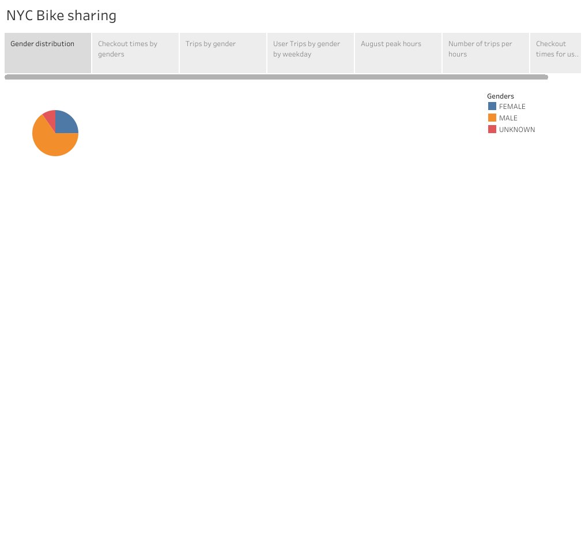
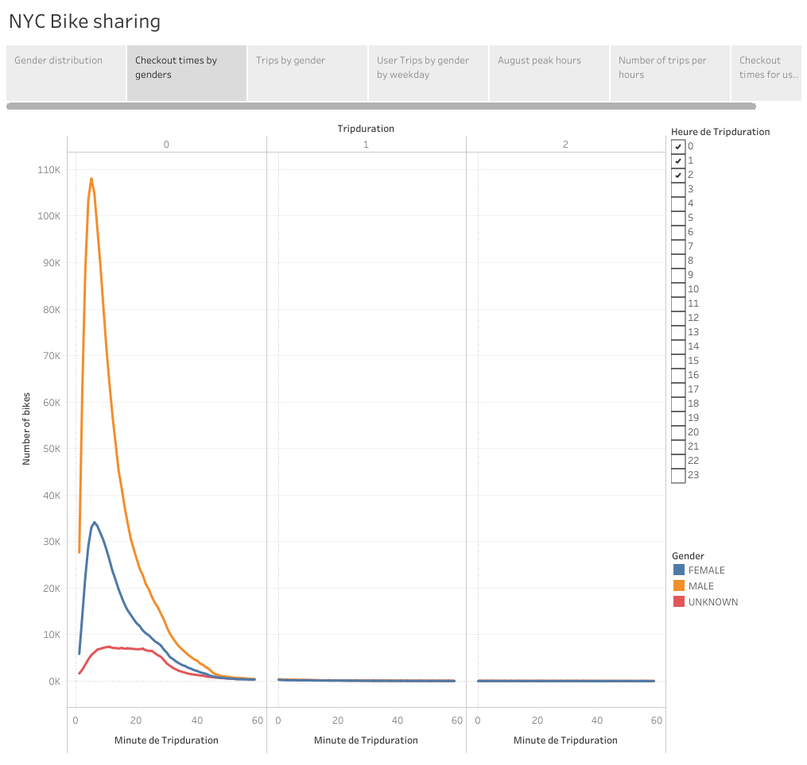
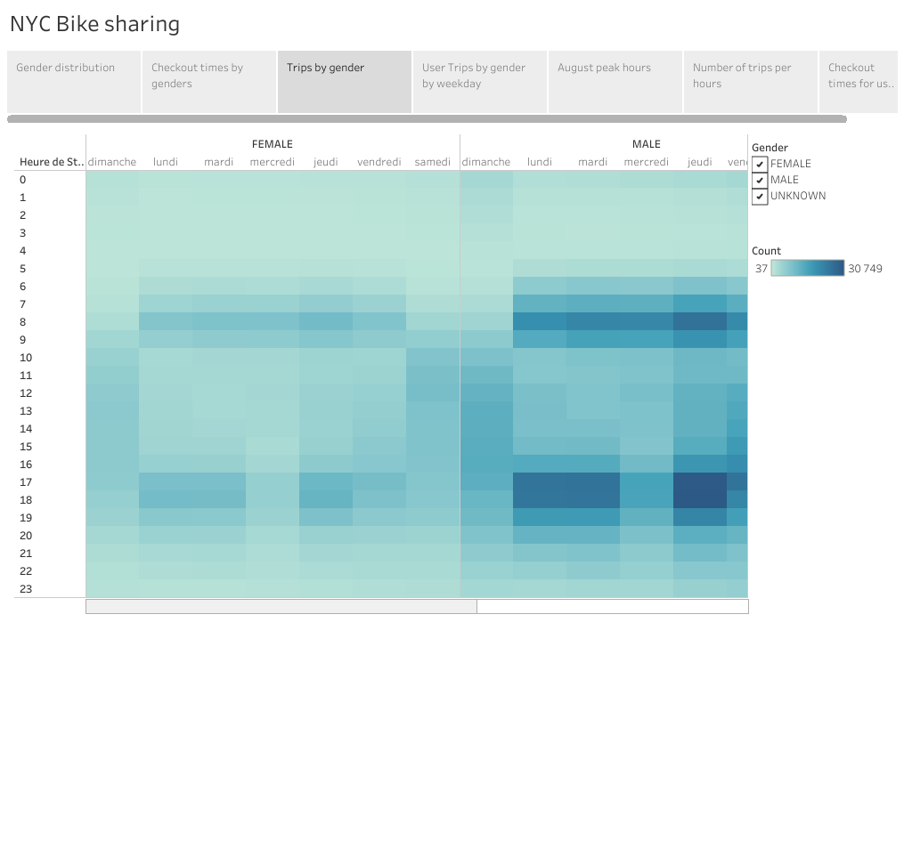
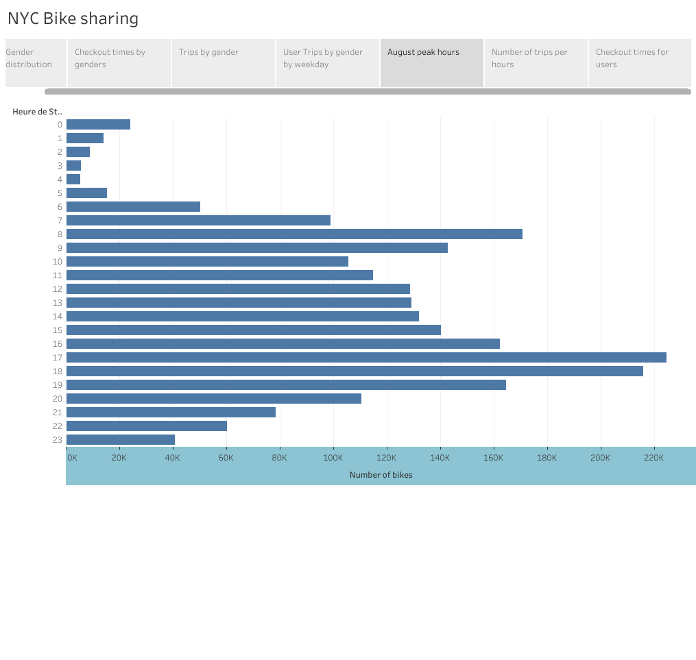
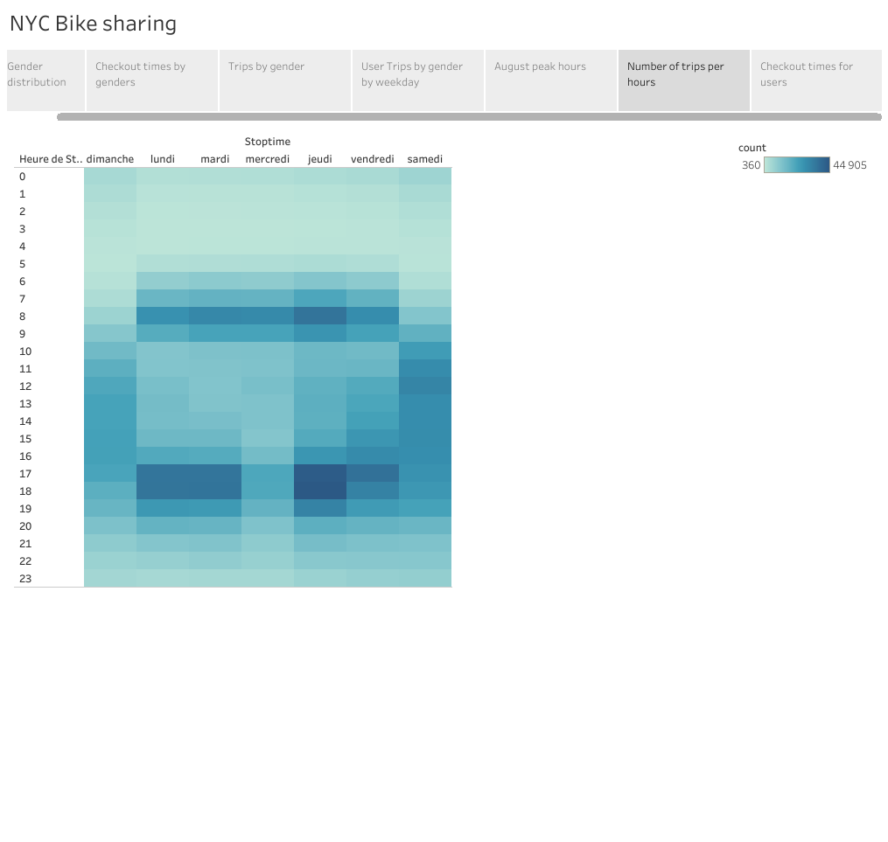
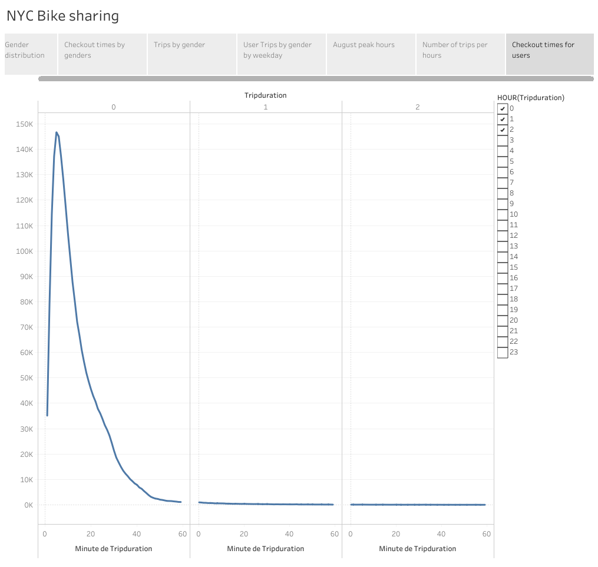

# bikesharing

### Overview

The purpose of this analysis is to see how people from New York City use the Citi Bikesharing system. We also look for how this system could perform in Des Moines, Iowa. 

### Results

First, we break down who use this system the most. As we can see below, the men use the bikesharing more than the women.

Second, we can see that men and women mostly use the bike less than a hour. The peak for men is at 5 minutes and 6 for women. 

Third, both men and women use the bikes at the beginning and at the end of the traditionnal working days. 

Fourth, on this chart below, we see that the most popular days for women are Thursday, Friday and Saturday. For men it's Thursday, Friday and Tuesday. Further investigation might help us understand why Tuesdays are more popular than Saturdays for men. 

Fifth, we see that the bikes must be ready to roll at 8 AM but also at the end of the day at 5 and 6 PM. People rely on them to go to theur job and to go home. 

Sixth, this chart below show us how people use the bikesharing system through the day. 

Seventh, when we aggregate the checkout times for the users we see that people mostly use the bike between 0 and 40 minutes. 

### Summary

As we can see, people mostly use the bikes to go and to comeback from work. They use them less than a hour per checkout and people also like to use them on the weekends. However, it is New York City so on the weekends we might expect a lot of tourists who use the bikes. Further research might guide us to see if it's the subscribers or the one time users who use the bikes the most on the weekends. We would also like to know the distance the people do with the bikes per checkout. It could guide us to see where bike stations need to be in Des Moines. 

For more information, please consult this Tableau Story :

[link to dashboard](https://public.tableau.com/app/profile/leandre.leblanc/viz/Book1_16444390570760/NYCBikesharing)

### 
